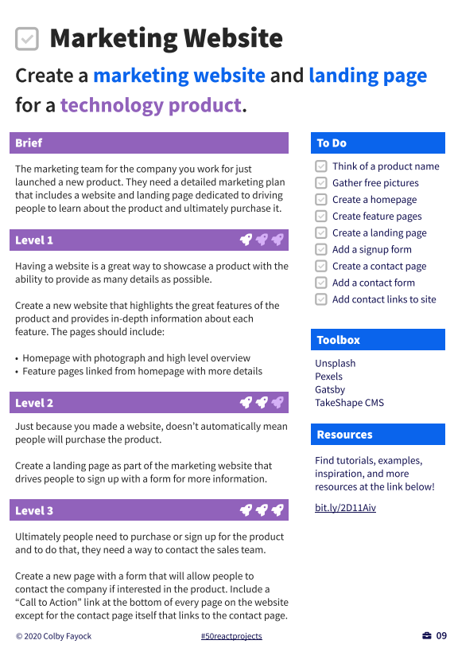
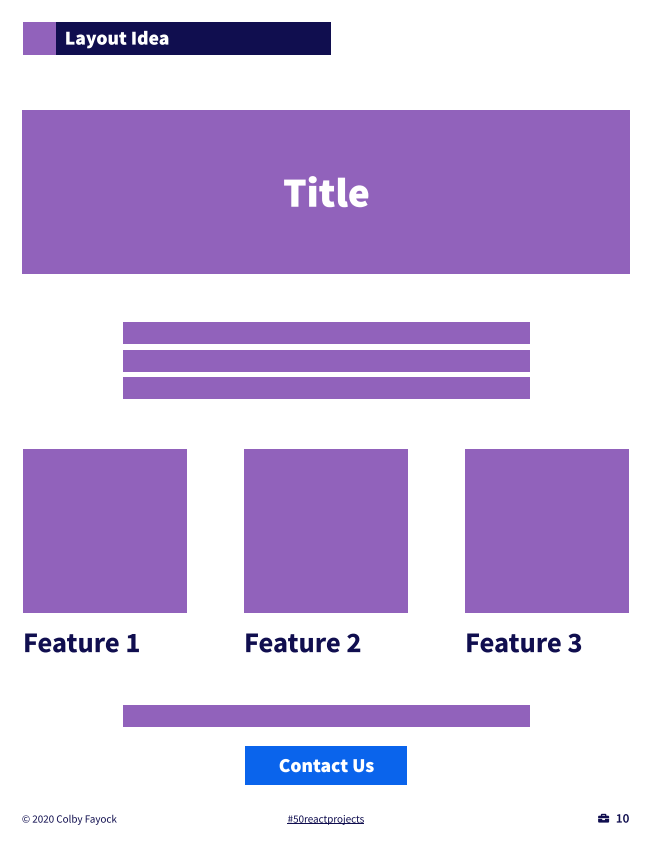

# Marketing Website
Create a marketing website and landing page and for a technology product.

## Intro
The marketing team for the company you work for just 
launched a new product. They need a detailed marketing plan 
that includes a website and landing page dedicated to driving 
people to learn about the product and ultimately purchase it.

**Level 1**
Having a website is a great way to showcase a product with the 
ability to provide as many details as possible.

Create a new website that highlights the great features of the 
product and provides in-depth information about each 
feature. The pages should include:

• Homepage with photograph and high level overview
• Feature pages linked from homepage with more detail

**Level 2**
Just because you made a website, doesn’t automatically mean 
people will purchase the product.

Create a landing page as part of the marketing website that 
drives people to sign up with a form for more information.

**Level 3**
Ultimately people need to purchase or sign up for the product 
and to do that, they need a way to contact the sales team.

Create a new page with a form that will allow people to 
contact the company if interested in the product. Include a 
“Call to Action” link at the bottom of every page on the website 
except for the contact page itself that links to the contact page.

